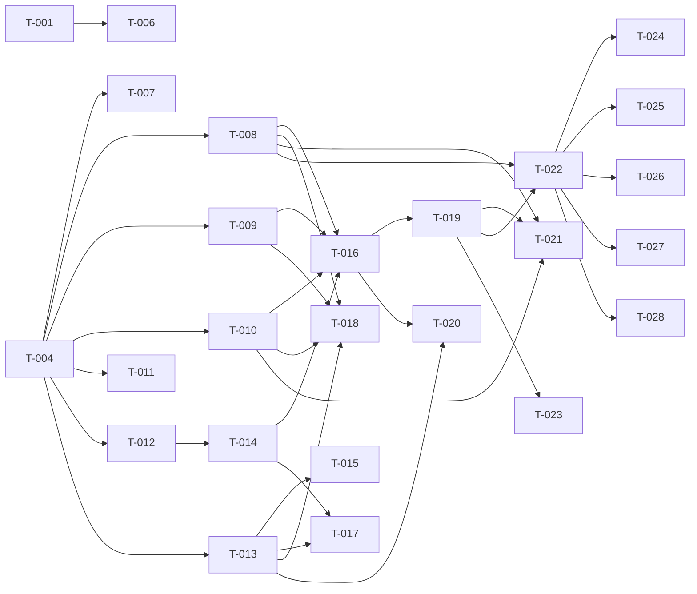

# Build Site -- HomeView v1 PWA + Server Gaps

## Tier 0 -- No Dependencies (Start Here)

| Task | Title | Kit | Requirement | blockedBy | Effort |
|------|-------|-----|-------------|-----------|--------|
| T-001 | Pairing error envelope | cavekit-server-gaps | R1 | none | S |
| T-002 | Cell health WS events | cavekit-server-gaps | R2 | none | M |
| T-003 | Static serving + CORS | cavekit-server-gaps | R4 | none | M |
| T-004 | Vite + React + TS project scaffold | cavekit-pwa-scaffold | R1 | none | M |
| T-005 | Vite dev proxy | cavekit-pwa-scaffold | R3 | none | S |

## Tier 1 -- Depends on Tier 0

| Task | Title | Kit | Requirement | blockedBy | Effort |
|------|-------|-----|-------------|-----------|--------|
| T-006 | TV pairing overlay | cavekit-server-gaps | R3 | T-001 | M |
| T-007 | PWA manifest + service worker | cavekit-pwa-scaffold | R2 | T-004 | M |
| T-008 | API client layer -- public endpoints | cavekit-pwa-scaffold | R4 (partial) | T-004 | M |
| T-009 | API client layer -- protected endpoints | cavekit-pwa-scaffold | R4 (partial) | T-004 | M |
| T-010 | API client layer -- error handling + auth | cavekit-pwa-scaffold | R4 (partial) | T-004 | S |
| T-011 | Production build integration | cavekit-pwa-scaffold | R5 | T-004 | S |
| T-012 | App state shape + types | cavekit-pwa-state | R1 | T-004 | M |
| T-013 | Test infrastructure (Vitest + jsdom) | cavekit-pwa-tests | R1 | T-004 | M |

## Tier 2 -- Depends on Tier 1

| Task | Title | Kit | Requirement | blockedBy | Effort |
|------|-------|-----|-------------|-----------|--------|
| T-014 | State reducer | cavekit-pwa-state | R2 | T-012 | M |
| T-015 | Coverage threshold config | cavekit-pwa-tests | R5 | T-013 | S |

## Tier 3 -- Depends on Tier 2

| Task | Title | Kit | Requirement | blockedBy | Effort |
|------|-------|-----|-------------|-----------|--------|
| T-016 | WebSocket hook | cavekit-pwa-state | R3 | T-014, T-008, T-009, T-010 | M |
| T-017 | Reducer tests | cavekit-pwa-tests | R2 | T-014, T-013 | M |
| T-018 | API client tests | cavekit-pwa-tests | R3 | T-008, T-009, T-010, T-013 | M |

## Tier 4 -- Depends on Tier 3

| Task | Title | Kit | Requirement | blockedBy | Effort |
|------|-------|-----|-------------|-----------|--------|
| T-019 | Context provider | cavekit-pwa-state | R4 | T-016 | M |
| T-020 | WS hook tests | cavekit-pwa-tests | R4 | T-016, T-013 | M |

## Tier 5 -- Depends on Tier 4

| Task | Title | Kit | Requirement | blockedBy | Effort |
|------|-------|-----|-------------|-----------|--------|
| T-021 | Pair screen | cavekit-pwa-screens | R1 | T-019, T-008, T-010 | M |
| T-022 | Main screen + CellCard | cavekit-pwa-screens | R2 | T-019, T-008 | M |
| T-023 | Settings screen | cavekit-pwa-screens | R8 | T-019 | S |

## Tier 6 -- Depends on Tier 5

| Task | Title | Kit | Requirement | blockedBy | Effort |
|------|-------|-----|-------------|-----------|--------|
| T-024 | Source Picker | cavekit-pwa-screens | R3 | T-022 | M |
| T-025 | Layout Picker screen | cavekit-pwa-screens | R4 | T-022 | M |
| T-026 | Audio Picker screen | cavekit-pwa-screens | R5 | T-022 | M |
| T-027 | Presets screen | cavekit-pwa-screens | R6 | T-022 | M |
| T-028 | Interactive mode | cavekit-pwa-screens | R7 | T-022 | M |

---

## Summary

| Metric | Value |
|--------|-------|
| Total tasks | 28 |
| Tier 0 (parallelizable) | 5 |
| Tier 1 | 8 |
| Tier 2 | 2 |
| Tier 3 | 3 |
| Tier 4 | 2 |
| Tier 5 | 3 |
| Tier 6 | 5 |
| Small (S) | 5 |
| Medium (M) | 23 |
| Large (L) | 0 |
| Server-side tasks | 4 |
| PWA tasks | 24 |

---

## Task Details

### T-001: Pairing Error Envelope

**Cavekit Requirement:** server-gaps/R1
**Acceptance Criteria Mapped:** R1.1 (GET /pair/code 404 envelope), R1.2 (POST /pair 401 envelope), R1.3 (POST /pair 409 envelope), R1.4 (envelope shape), R1.5 (details always object), R1.6 (success unchanged)
**blockedBy:** none
**Effort:** S
**Description:** Modify the pairing routes in `server/api/routes.py` (and/or `server/auth/pairing.py`) to return error responses in the standard envelope format `{"error": {"code": "SNAKE_CASE", "message": "...", "details": {}}}` instead of bare HTTPException detail strings. Three error codes to implement: `NOT_PAIRED_OR_EXPIRED` (404), `INVALID_PAIRING_CODE` (401), `ALREADY_PAIRED` (409). Verify success paths remain unchanged. Add/update tests in `tests/test_routes.py` to assert all three error envelopes.
**Files:** `server/api/routes.py`, `server/auth/pairing.py`, `tests/test_routes.py`
**Test Strategy:** Unit tests asserting response body shape for each error code; verify success responses unchanged.

### T-002: Cell Health WS Events

**Cavekit Requirement:** server-gaps/R2
**Acceptance Criteria Mapped:** R2.1 (cell_restarting event), R2.2 (cell_recovered event), R2.3 (cell_failed event), R2.4 (mock mode parity)
**blockedBy:** none
**Effort:** M
**Description:** Wire the `HealthMonitor` with an `on_event` callback that calls `EventBus.emit` with `type: "cell.health"` and `data: {"cell_index": <int>, "event_type": "<event>", "detail": "<string>"}`. The callback should be set during engine or app startup in `server/main.py` lifespan. Ensure mock mode uses the same event path. Add tests verifying WS clients receive cell.health messages for all three event types.
**Files:** `server/main.py`, `server/composition/engine.py`, `server/composition/health.py` (if exists), `tests/test_health.py` or `tests/test_engine.py`
**Test Strategy:** Unit tests with mock EventBus verifying emit calls for each event type; integration test with test WS client.

### T-003: Static Serving + CORS

**Cavekit Requirement:** server-gaps/R4
**Acceptance Criteria Mapped:** R4.1 (.gitkeep), R4.2 (.gitignore entry), R4.3 (conditional StaticFiles mount), R4.4 (no error without index.html), R4.5 (SPA fallback), R4.6 (API not shadowed), R4.7 (WS not shadowed), R4.8 (CORS localhost:5173), R4.9 (CORS any origin in mock)
**blockedBy:** none
**Effort:** M
**Description:** Create `server/static/` with `.gitkeep`. Add `server/static/` exclusion to `.gitignore` (keep .gitkeep). In `server/main.py`, conditionally mount `StaticFiles` with `html=True` ONLY when `server/static/index.html` exists -- mount LAST so API and WS routes take priority. Add `CORSMiddleware` allowing `http://localhost:5173` origin in dev/mock mode (or all origins when `HOMEVIEW_MOCK=1`). Add tests verifying: API routes still work, WS still works, static files served when present, server starts without static dir, CORS headers present.
**Files:** `server/static/.gitkeep`, `.gitignore`, `server/main.py`, `tests/test_main.py` or `tests/test_static.py`
**Test Strategy:** Unit tests for conditional mount logic; integration tests for CORS headers and route priority.

### T-004: Vite + React + TS Project Scaffold

**Cavekit Requirement:** pwa-scaffold/R1
**Acceptance Criteria Mapped:** R1.1 (package.json), R1.2 (tsconfig strict), R1.3 (vite.config.ts), R1.4 (index.html), R1.5 (main.tsx), R1.6 (App.tsx), R1.7 (build exits 0)
**blockedBy:** none
**Effort:** M
**Description:** Create `pwa/` directory with: `package.json` declaring `react`, `react-dom`, `typescript`, `@types/react`, `@types/react-dom`, `vite`, `@vitejs/plugin-react` as deps. `tsconfig.json` with `strict: true`. `vite.config.ts` with React plugin. `index.html` with `
`. `src/main.tsx` rendering `<App />` into root. `src/App.tsx` with default export component. Run `npm install` and verify `npm run build` exits 0.
**Files:** `pwa/package.json`, `pwa/tsconfig.json`, `pwa/vite.config.ts`, `pwa/index.html`, `pwa/src/main.tsx`, `pwa/src/App.tsx`
**Test Strategy:** Build check -- `npm run build` in `pwa/` exits 0.

### T-005: Vite Dev Proxy

**Cavekit Requirement:** pwa-scaffold/R3
**Acceptance Criteria Mapped:** R3.1 (/api proxy), R3.2 (/ws proxy), R3.3 (WS upgrade headers), R3.4 (Authorization preserved)
**blockedBy:** none
**Effort:** S
**Description:** Configure Vite's `server.proxy` in `pwa/vite.config.ts` to forward `/api` to `http://localhost:8000` and `/ws` to `ws://localhost:8000` with `ws: true` and `changeOrigin: true`. The proxy preserves all headers including `Authorization` by default. Note: this can be written before `pwa/` exists if T-004 runs first, but the config is standalone.
**Files:** `pwa/vite.config.ts`
**Test Strategy:** Manual verification -- start Vite dev server + HomeView mock server, confirm proxy works. Proxy config is declarative; correctness is structural.

### T-006: TV Pairing Overlay

**Cavekit Requirement:** server-gaps/R3
**Acceptance Criteria Mapped:** R3.1 (overlay on unpaired boot), R3.2 (uses Cell/ChromiumLauncher), R3.3 (closes on pair), R3.4 (single-instance), R3.5 (mock mode), R3.6 (skip when paired)
**blockedBy:** T-001
**Effort:** M
**Description:** Add a `PairingOverlay` class (or integrate into `CompositionEngine`) that: checks `PairingManager.is_paired()` on startup; if unpaired, creates a `Cell` with `ChromiumLauncher` pointing to a local HTML page showing the pairing code; registers a callback on pairing success to stop the overlay cell; enforces single-instance (guard against multiple overlays). In mock mode, `MockChromiumLauncher` handles the cell. Add tests verifying overlay lifecycle.
**Files:** `server/composition/overlay.py` (new), `server/main.py`, `tests/test_overlay.py` (new)
**Test Strategy:** Unit tests with MockChromiumLauncher verifying: overlay starts when unpaired, closes on pair, does not start when already paired, single-instance guard.

### T-007: PWA Manifest + Service Worker

**Cavekit Requirement:** pwa-scaffold/R2
**Acceptance Criteria Mapped:** R2.1 (name/short_name), R2.2 (display standalone), R2.3 (theme_color), R2.4 (background_color), R2.5 (icons 192+512), R2.6 (SW registered), R2.7 (SW caches static), R2.8 (/api network-first), R2.9 (/ws not intercepted), R2.10 (Lighthouse >=90)
**blockedBy:** T-004
**Effort:** M
**Design Ref:** DESIGN.md Section 2 (--color-bg-deep #0A0A0F for theme/bg colors)
**Description:** Install `vite-plugin-pwa` (or manually create). Create `public/manifest.json` with `name: "HomeView"`, `short_name: "HomeView"`, `display: "standalone"`, `theme_color: "#0A0A0F"`, `background_color: "#0A0A0F"`, icons array with 192x192 and 512x512 entries. Create placeholder icon PNGs. Configure service worker: cache static assets (precache), network-first for `/api/*`, exclude `/ws/*` from interception. Register SW in `main.tsx` or via plugin. Lighthouse PWA audit target >= 90.
**Files:** `pwa/public/manifest.json`, `pwa/public/icon-192.png`, `pwa/public/icon-512.png`, `pwa/src/sw.ts` (or plugin config), `pwa/vite.config.ts`
**Test Strategy:** Build + Lighthouse PWA audit >= 90. Manual check of manifest fields.

### T-008: API Client Layer -- Public Endpoints

**Cavekit Requirement:** pwa-scaffold/R4 (partial: R4.2, R4.3, R4.18)
**Acceptance Criteria Mapped:** R4.2 (getPairCode), R4.3 (pair), R4.18 (no auth on public endpoints)
**blockedBy:** T-004
**Effort:** M
**Description:** Create `pwa/src/api/client.ts`. Implement `getPairCode(serverUrl)` calling `GET /api/v1/pair/code` and `pair(serverUrl, code)` calling `POST /api/v1/pair`. These functions do NOT attach Authorization headers. `getPairCode` returns `{code, expires_at}` or throws on 404. `pair` returns the bearer token string or throws on 4xx. Both functions accept `serverUrl` as a parameter for the base URL.
**Files:** `pwa/src/api/client.ts`
**Test Strategy:** Covered by T-018 (API client tests).

### T-009: API Client Layer -- Protected Endpoints

**Cavekit Requirement:** pwa-scaffold/R4 (partial: R4.1, R4.4-R4.16, R4.17, R4.19)
**Acceptance Criteria Mapped:** R4.1 (module exports typed functions), R4.4 (getStatus), R4.5 (getSources), R4.6 (assignSource), R4.7 (clearCell), R4.8 (setLayout), R4.9 (getLayouts), R4.10 (setActiveAudio), R4.11 (getPresets), R4.12 (savePreset), R4.13 (applyPreset), R4.14 (deletePreset), R4.15 (startInteractive), R4.16 (stopInteractive), R4.17 (auth header on protected), R4.19 (token from param/context)
**blockedBy:** T-004
**Effort:** M
**Description:** Extend `pwa/src/api/client.ts` with all protected endpoint functions. Each function accepts `serverUrl` and `token` as parameters (or a config object). All attach `Authorization: Bearer <token>` header. Functions: `getStatus`, `getSources`, `assignSource(cellIndex, sourceId)`, `clearCell(cellIndex)`, `setLayout(layoutId)`, `getLayouts`, `setActiveAudio(cellIndex)`, `getPresets`, `savePreset(name)`, `applyPreset(presetId)`, `deletePreset(presetId)`, `startInteractive(cellIndex)`, `stopInteractive`. Each function uses correct HTTP method and URL path per the kit spec.
**Files:** `pwa/src/api/client.ts`
**Test Strategy:** Covered by T-018 (API client tests).

### T-010: API Client Layer -- Error Handling + Auth Pattern

**Cavekit Requirement:** pwa-scaffold/R4 (partial: R4.17 error parsing)
**Acceptance Criteria Mapped:** R4.17 (typed error parsing from envelope)
**blockedBy:** T-004
**Effort:** S
**Description:** Add shared error handling to `pwa/src/api/client.ts`: a helper that checks response status, parses `{"error": {"code": "...", "message": "..."}}` from body, and throws a typed `ApiError` class with `code` and `message` properties. All client functions use this helper. Export the `ApiError` type for consumers.
**Files:** `pwa/src/api/client.ts`, `pwa/src/api/errors.ts` (optional separate file)
**Test Strategy:** Covered by T-018 (API client tests -- error envelope parsing test).

### T-011: Production Build Integration

**Cavekit Requirement:** pwa-scaffold/R5
**Acceptance Criteria Mapped:** R5.1 (outDir ../server/static), R5.2 (emptyOutDir), R5.3 (index.html exists after build), R5.4 (.gitignore entry)
**blockedBy:** T-004
**Effort:** S
**Description:** In `pwa/vite.config.ts`, set `build.outDir` to `"../server/static"` and `build.emptyOutDir` to `true`. Verify `.gitignore` at repo root has `server/static/` entry (coordinated with T-003). After `npm run build`, confirm `server/static/index.html` exists.
**Files:** `pwa/vite.config.ts`, `.gitignore`
**Test Strategy:** Build check -- run `npm run build` in `pwa/`, verify `server/static/index.html` exists.

### T-012: App State Shape + Types

**Cavekit Requirement:** pwa-state/R1
**Acceptance Criteria Mapped:** R1.1-R1.15 (all 15 criteria: AppState fields, sub-type shapes, initial state)
**blockedBy:** T-004
**Effort:** M
**Description:** Create `pwa/src/state/types.ts` defining TypeScript interfaces: `AppState`, `ServerStatus`, `CellStatus`, `Source`, `Preset`, `Layout` (with nested cell shape). Create `pwa/src/state/initial.ts` exporting `initialState` with all fields set to their default values (`null`, `false`, `"unpaired"`). All types must match the shapes specified in the kit exactly.
**Files:** `pwa/src/state/types.ts`, `pwa/src/state/initial.ts`
**Test Strategy:** TypeScript compilation check. Covered by T-017 (reducer tests verify initial state).

### T-013: Test Infrastructure (Vitest + jsdom)

**Cavekit Requirement:** pwa-tests/R1
**Acceptance Criteria Mapped:** R1.1 (jsdom env), R1.2 (test script), R1.3 (test:coverage script), R1.4 (vitest.config.ts with thresholds), R1.5 (fetch mockable), R1.6 (WebSocket mockable)
**blockedBy:** T-004
**Effort:** M
**Description:** Install `vitest`, `@vitest/coverage-v8`, `jsdom` as dev dependencies. Create `pwa/vitest.config.ts` with `environment: "jsdom"` and coverage thresholds for `src/state/` and `src/api/` at 80% lines. Add `"test": "vitest run"` and `"test:coverage": "vitest run --coverage"` scripts to `package.json`. Create a test setup file that makes `fetch` and `WebSocket` mockable via `vi.stubGlobal`. Add a smoke test to verify the setup works.
**Files:** `pwa/vitest.config.ts`, `pwa/package.json`, `pwa/src/test-setup.ts`, `pwa/src/__tests__/smoke.test.ts`
**Test Strategy:** `npm test` exits 0 with the smoke test passing.

### T-014: State Reducer

**Cavekit Requirement:** pwa-state/R2
**Acceptance Criteria Mapped:** R2.1 (reducer signature), R2.2 (SET_SERVER), R2.3 (CLEAR_SERVER), R2.4 (SET_STATUS), R2.5 (SET_SOURCES), R2.6 (SET_LAYOUTS), R2.7 (SET_PRESETS), R2.8 (SET_WS_CONNECTED), R2.9 (SET_INTERACTIVE), R2.10 (CLEAR_INTERACTIVE), R2.11 (immutable), R2.12 (unrecognized passthrough), R2.13 (discriminated union)
**blockedBy:** T-012
**Effort:** M
**Description:** Create `pwa/src/state/reducer.ts`. Define `Action` as a discriminated union (tagged on `type` field) covering all 9 action types. Implement `reducer(state: AppState, action: Action): AppState` that returns a new object for each recognized action, spreads existing state, and returns input state unchanged for unrecognized types. `SET_SERVER` sets serverUrl, token, pairPhase="paired". `CLEAR_SERVER` returns `initialState`. All updates are immutable (spread operator).
**Files:** `pwa/src/state/reducer.ts`
**Test Strategy:** Covered by T-017 (reducer tests).

### T-015: Coverage Threshold Config

**Cavekit Requirement:** pwa-tests/R5
**Acceptance Criteria Mapped:** R5.1 (src/state/ >=80%), R5.2 (src/api/ >=80%), R5.3 (non-zero exit on failure)
**blockedBy:** T-013
**Effort:** S
**Description:** Verify `pwa/vitest.config.ts` coverage configuration has per-directory thresholds: `src/state/` at 80% lines and `src/api/` at 80% lines. Vitest's coverage provider exits non-zero when thresholds are not met by default. This may already be done in T-013; this task validates and adjusts if needed.
**Files:** `pwa/vitest.config.ts`
**Test Strategy:** Run `npm run test:coverage` with insufficient coverage and verify non-zero exit.

### T-016: WebSocket Hook

**Cavekit Requirement:** pwa-state/R3
**Acceptance Criteria Mapped:** R3.1 (connect when both non-null), R3.2 (no connect when null), R3.3 (state.updated -> SET_STATUS), R3.4 (cell.health -> fetch -> SET_STATUS), R3.5 (on open fetch+dispatch), R3.6 (on open SET_WS_CONNECTED true), R3.7 (on close SET_WS_CONNECTED false), R3.8 (on error SET_WS_CONNECTED false), R3.9 (exponential backoff 1s/2x/30s), R3.10 (reset backoff on success), R3.11 (cleanup on unmount), R3.12 (cleanup on token->null)
**blockedBy:** T-014, T-008, T-009, T-010
**Effort:** M
**Description:** Create `pwa/src/state/useWebSocket.ts`. Custom React hook `useWebSocket(serverUrl, token, dispatch)`. Connects to `ws://{serverUrl}/ws/control?token={token}`. On open: fetch status via API client, dispatch SET_STATUS + SET_WS_CONNECTED(true). On message: parse JSON, handle `state.updated` (dispatch SET_STATUS with data) and `cell.health` (fetch status, dispatch SET_STATUS). On close/error: dispatch SET_WS_CONNECTED(false), schedule reconnect with exponential backoff (1s initial, 2x multiplier, 30s max). Reset backoff on successful open. Cleanup on unmount and token->null transitions. Use `useEffect` + `useRef` for connection lifecycle.
**Files:** `pwa/src/state/useWebSocket.ts`
**Test Strategy:** Covered by T-020 (WS hook tests).

### T-017: Reducer Tests

**Cavekit Requirement:** pwa-tests/R2
**Acceptance Criteria Mapped:** R2.1 (SET_SERVER test), R2.2 (CLEAR_SERVER test), R2.3 (SET_STATUS test), R2.4 (SET_SOURCES test), R2.5 (SET_LAYOUTS test), R2.6 (SET_PRESETS test), R2.7 (SET_WS_CONNECTED test), R2.8 (SET_INTERACTIVE test), R2.9 (CLEAR_INTERACTIVE test)
**blockedBy:** T-014, T-013
**Effort:** M
**Description:** Create `pwa/src/state/__tests__/reducer.test.ts`. One test per action type (9 tests minimum). Each test creates an initial state, dispatches the action, and asserts the output state matches expectations. Verify SET_SERVER stores url+token+pairPhase. Verify CLEAR_SERVER resets to initial. Verify SET_STATUS replaces status without wiping other fields. Etc.
**Files:** `pwa/src/state/__tests__/reducer.test.ts`
**Test Strategy:** `npm test` passes all reducer tests.

### T-018: API Client Tests

**Cavekit Requirement:** pwa-tests/R3
**Acceptance Criteria Mapped:** R3.1 (pair test), R3.2 (assignSource test), R3.3 (getPresets test), R3.4 (error envelope test)
**blockedBy:** T-008, T-009, T-010, T-013
**Effort:** M
**Description:** Create `pwa/src/api/__tests__/client.test.ts`. Mock `fetch` globally. Test `pair()`: assert POST method, URL, body, successful token return. Test `assignSource()`: assert PUT method, URL with cell index, body with source_id, Authorization header present. Test `getPresets()`: assert GET method, URL, auth header, response parsing. Test error handling: mock non-2xx response with error envelope body, assert thrown error contains parsed code.
**Files:** `pwa/src/api/__tests__/client.test.ts`
**Test Strategy:** `npm test` passes all API client tests.

### T-019: Context Provider

**Cavekit Requirement:** pwa-state/R4
**Acceptance Criteria Mapped:** R4.1 (exposes state+dispatch), R4.2 (localStorage read on mount), R4.3 (SET_SERVER persists), R4.4 (CLEAR_SERVER removes), R4.5 (activates WS hook), R4.6 (no unnecessary re-renders), R4.7 (error outside provider)
**blockedBy:** T-016
**Effort:** M
**Description:** Create `pwa/src/state/AppProvider.tsx` and `pwa/src/state/context.ts`. Use `React.createContext` with `useReducer`. On mount, read `serverUrl` and `token` from `localStorage`; if both present, initialize with `pairPhase: "paired"`. Wrap dispatch to intercept `SET_SERVER` (persist to localStorage) and `CLEAR_SERVER` (remove from localStorage). Call `useWebSocket(state.serverUrl, state.token, dispatch)`. Export `useAppState()` hook that throws if used outside provider. Consider splitting state/dispatch into separate contexts to minimize re-renders.
**Files:** `pwa/src/state/AppProvider.tsx`, `pwa/src/state/context.ts`
**Test Strategy:** Integration: wrap test component in provider, verify state/dispatch accessible. Verify error when used outside provider.

### T-020: WS Hook Tests

**Cavekit Requirement:** pwa-tests/R4
**Acceptance Criteria Mapped:** R4.1 (reconnect on close), R4.2 (SET_WS_CONNECTED true on reconnect), R4.3 (no connect when null), R4.4 (exponential backoff)
**blockedBy:** T-016, T-013
**Effort:** M
**Description:** Create `pwa/src/state/__tests__/useWebSocket.test.ts`. Mock WebSocket globally. Test reconnect: simulate close event, advance timers, verify new WebSocket created. Test SET_WS_CONNECTED(true) dispatched on reconnect open. Test no connection when token is null. Test exponential backoff: simulate two consecutive closes, verify second delay > first delay.
**Files:** `pwa/src/state/__tests__/useWebSocket.test.ts`
**Test Strategy:** `npm test` passes all WS hook tests.

### T-021: Pair Screen

**Cavekit Requirement:** pwa-screens/R1
**Acceptance Criteria Mapped:** R1.1 (shown when unpaired), R1.2 (server URL input), R1.3 (code input), R1.4 (rejects non-numeric), R1.5 (submit disabled until valid), R1.6 (calls POST /pair), R1.7 (success -> SET_SERVER + navigate), R1.8 (error shows message), R1.9 (input styling), R1.10 (button styling), R1.11 (code mono font), R1.12 (44px targets)
**blockedBy:** T-019, T-008, T-010
**Effort:** M
**Design Ref:** DESIGN.md Section 4.5 (Text Inputs), Section 4.1 (Primary button), Section 3 (--font-mono), Section 7 (44px touch targets), Section 2 (--color-error)
**Description:** Create `pwa/src/screens/PairScreen.tsx`. Render when `pairPhase === "unpaired"`. Server URL text input + 6-digit numeric code input. Code input: `inputMode="numeric"`, reject non-digits, enforce length 6. Submit button disabled until URL non-empty and code is 6 digits. On submit: call `pair(serverUrl, code)` from API client. On success: dispatch `SET_SERVER({serverUrl, token})`. On error: show error message in `--color-error`. Style inputs per DESIGN.md 4.5, button per 4.1, code input in `--font-mono`. All targets >= 44px.
**Files:** `pwa/src/screens/PairScreen.tsx`, `pwa/src/screens/PairScreen.css` (or CSS module)
**Test Strategy:** Manual verification of UI states. Acceptance criteria validated by visual inspection + interaction testing.

### T-022: Main Screen + CellCard

**Cavekit Requirement:** pwa-screens/R2
**Acceptance Criteria Mapped:** R2.1 (shown when paired), R2.2 (CellCard per cell in grid), R2.3 (source name or empty), R2.4 (cell status), R2.5 (audio indicator), R2.6 (CellCard states per DESIGN.md), R2.7 (tap opens Source Picker), R2.8 (navigation elements), R2.9 (wsConnected=false banner), R2.10 (wsConnected=true no banner), R2.11 (grid layout per DESIGN.md)
**blockedBy:** T-019, T-008
**Effort:** M
**Design Ref:** DESIGN.md Section 4.2 (CellCard), Section 4.7 (Status Badge), Section 5 (Grid patterns), Section 2 (--color-warning for banner)
**Description:** Create `pwa/src/screens/MainScreen.tsx` and `pwa/src/components/CellCard.tsx`. MainScreen renders when `pairPhase === "paired"`. Maps `status.cells` to CellCard components in a responsive grid (1-col mobile, 2-col tablet, auto-fill desktop per DESIGN.md Section 5). CellCard shows source name or "Tap to assign", status (EMPTY/STARTING/RUNNING/ERROR), audio indicator badge. Uses `data-status` attribute for state-driven styling. Dashed border when empty, success/error left accent bar. Tap opens Source Picker. Navigation to Layouts, Audio, Presets, Settings. WS disconnected banner with `--color-warning`.
**Files:** `pwa/src/screens/MainScreen.tsx`, `pwa/src/components/CellCard.tsx`, `pwa/src/components/CellCard.css`, `pwa/src/screens/MainScreen.css`
**Test Strategy:** Visual inspection of all cell states. Responsive layout verification at breakpoints.

### T-023: Settings Screen

**Cavekit Requirement:** pwa-screens/R8
**Acceptance Criteria Mapped:** R8.1 (navigable from main), R8.2 (forget server action), R8.3 (clears localStorage), R8.4 (dispatches CLEAR_SERVER), R8.5 (navigates to Pair), R8.6 (destructive button), R8.7 (44px target)
**blockedBy:** T-019
**Effort:** S
**Design Ref:** DESIGN.md Section 4.1 (Destructive button variant), Section 7 (44px touch targets)
**Description:** Create `pwa/src/screens/SettingsScreen.tsx`. Navigable from Main screen. Contains "Forget server" button styled as destructive (DESIGN.md 4.1). On tap: clears localStorage (serverUrl, token), dispatches `CLEAR_SERVER`, navigates to Pair screen. Button meets 44px minimum touch target.
**Files:** `pwa/src/screens/SettingsScreen.tsx`
**Test Strategy:** Manual verification of forget flow. Verify localStorage cleared and navigation works.

### T-024: Source Picker

**Cavekit Requirement:** pwa-screens/R3
**Acceptance Criteria Mapped:** R3.1 (bottom sheet/modal), R3.2 (fetches sources), R3.3 (loading indicator), R3.4 (name+icon), R3.5 (tap assigns source), R3.6 (success closes + WS update), R3.7 (Clear action), R3.8 (clear success), R3.9 (error message), R3.10 (backdrop), R3.11 (44px targets)
**blockedBy:** T-022
**Effort:** M
**Design Ref:** DESIGN.md Section 4.3 (SourcePickerModal), Section 6 (Elevation/backdrop blur), Section 2 (--color-bg-elevated, --color-error), Section 7 (44px touch targets)
**Description:** Create `pwa/src/components/SourcePicker.tsx`. Bottom sheet on mobile (< 768px), centered modal on tablet+ per DESIGN.md 4.3. Fetches sources if `state.sources` is null. Shows loading spinner during fetch. Lists sources with name and icon. Tap source: `assignSource(cellIndex, sourceId)`. On success: close modal (WS push updates state). "Clear" action: `clearCell(cellIndex)`. On error: inline error in `--color-error`. Backdrop with `--shadow-high` + `backdrop-filter: blur(4px)`. Background `--color-bg-elevated`. All targets >= 44px.
**Files:** `pwa/src/components/SourcePicker.tsx`, `pwa/src/components/SourcePicker.css`
**Test Strategy:** Visual inspection at mobile and tablet breakpoints. Interaction testing for assign/clear/error flows.

### T-025: Layout Picker Screen

**Cavekit Requirement:** pwa-screens/R4
**Acceptance Criteria Mapped:** R4.1 (navigable), R4.2 (lists layouts), R4.3 (name + preview), R4.4 (current layout styling), R4.5 (tap calls PUT /layout), R4.6 (success navigates back), R4.7 (error message), R4.8 (16:9 preview), R4.9 (responsive columns)
**blockedBy:** T-022
**Effort:** M
**Design Ref:** DESIGN.md Section 4.4 (LayoutPickerScreen), Section 8 (Behavior matrix -- 2/3/auto columns)
**Description:** Create `pwa/src/screens/LayoutPickerScreen.tsx`. Navigable from Main. Fetches layouts if `state.layouts` is null. Each layout card shows name + proportional preview grid with 16:9 aspect ratio. Current layout: `--color-accent-muted` bg + `--color-accent` border (`aria-selected="true"`). Tap non-active: `setLayout(layoutId)`. On success: navigate back, WS updates state. On error: `--color-error` message. Grid: 2 cols mobile, 3 cols tablet, auto-fill desktop.
**Files:** `pwa/src/screens/LayoutPickerScreen.tsx`, `pwa/src/screens/LayoutPickerScreen.css`
**Test Strategy:** Visual inspection of layout cards, responsive columns, active layout highlight.

### T-026: Audio Picker Screen

**Cavekit Requirement:** pwa-screens/R5
**Acceptance Criteria Mapped:** R5.1 (navigable), R5.2 (lists cells), R5.3 (active cell accent), R5.4 (non-RUNNING disabled), R5.5 (tap calls PUT /audio/active), R5.6 (success WS update), R5.7 (error message)
**blockedBy:** T-022
**Effort:** M
**Design Ref:** DESIGN.md Section 4.1 (button disabled state), Section 2 (--color-accent, --color-error)
**Description:** Create `pwa/src/screens/AudioPickerScreen.tsx`. Navigable from Main. Lists cells from `state.status.cells`. Active cell (`audio.active_cell`) highlighted with `--color-accent`. Non-RUNNING cells disabled (DESIGN.md 4.1 disabled: `--color-bg-overlay` bg, `--color-text-muted` text, `cursor: not-allowed`). Tap RUNNING cell: `setActiveAudio(cellIndex)`. On success: WS push updates state. On error: `--color-error` message.
**Files:** `pwa/src/screens/AudioPickerScreen.tsx`
**Test Strategy:** Visual inspection of active/disabled states. Interaction testing.

### T-027: Presets Screen

**Cavekit Requirement:** pwa-screens/R6
**Acceptance Criteria Mapped:** R6.1 (navigable), R6.2 (lists presets), R6.3 (shows name), R6.4 (Apply + Delete per row), R6.5 (Apply calls PUT), R6.6 (Delete calls DELETE + removes), R6.7 (Save current prompts), R6.8 (Save current calls POST), R6.9 (error message), R6.10 (Delete destructive), R6.11 (Apply primary), R6.12 (44px targets)
**blockedBy:** T-022
**Effort:** M
**Design Ref:** DESIGN.md Section 4.1 (Primary + Destructive button variants), Section 2 (--color-error), Section 7 (44px touch targets)
**Description:** Create `pwa/src/screens/PresetsScreen.tsx`. Navigable from Main. Fetches presets if `state.presets` is null. Each row: preset name + "Apply" (primary btn) + "Delete" (destructive btn). Apply: `applyPreset(id)`, WS updates state. Delete: `deletePreset(id)`, remove from displayed list on success. "Save current": prompt for name, call `savePreset(name)`, refresh preset list. On error: `--color-error` message. All targets >= 44px.
**Files:** `pwa/src/screens/PresetsScreen.tsx`
**Test Strategy:** Interaction testing for apply/delete/save flows. Visual inspection of button styles.

### T-028: Interactive Mode

**Cavekit Requirement:** pwa-screens/R7
**Acceptance Criteria Mapped:** R7.1 (start for RUNNING cells), R7.2 (calls POST /interactive/start), R7.3 (success -> SET_INTERACTIVE + indicator), R7.4 (409 -> warning message), R7.5 (stop available when active), R7.6 (calls POST /interactive/stop), R7.7 (success -> CLEAR_INTERACTIVE), R7.8 (reset on WS reconnect)
**blockedBy:** T-022
**Effort:** M
**Design Ref:** DESIGN.md Section 2 (--color-warning)
**Description:** Add interactive mode controls to the Main screen / CellCard. "Start Interactive" action for RUNNING cells: calls `startInteractive(cellIndex)`. On success: dispatch `SET_INTERACTIVE(cellIndex)`, show visual indicator. On 409: show `--color-warning` "already active" message. "Stop Interactive" visible when `state.interactiveCell !== null`: calls `stopInteractive()`. On success: dispatch `CLEAR_INTERACTIVE`. `interactiveCell` resets to null on WS reconnect (handled in WS hook -- dispatch CLEAR_INTERACTIVE on open).
**Files:** `pwa/src/screens/MainScreen.tsx` (modify), `pwa/src/components/CellCard.tsx` (modify), `pwa/src/state/useWebSocket.ts` (modify -- reset interactive on reconnect)
**Test Strategy:** Interaction testing for start/stop/409 flows. Verify reset on reconnect.

---

## Coverage Matrix

Every acceptance criterion from every kit requirement is listed below with the task(s) that cover it.

### server-gaps/R1: Pairing Error Envelope

| # | Criterion | Task(s) | Status |
|---|-----------|---------|--------|
| 1 | GET /pair/code 404 returns NOT_PAIRED_OR_EXPIRED envelope | T-001 | COVERED |
| 2 | POST /pair 401 returns INVALID_PAIRING_CODE envelope | T-001 | COVERED |
| 3 | POST /pair 409 returns ALREADY_PAIRED envelope | T-001 | COVERED |
| 4 | Envelope shape: error.code, error.message, error.details | T-001 | COVERED |
| 5 | details is always an object | T-001 | COVERED |
| 6 | Success paths unchanged | T-001 | COVERED |

### server-gaps/R2: Cell Health WS Events

| # | Criterion | Task(s) | Status |
|---|-----------|---------|--------|
| 1 | cell_restarting event via WS | T-002 | COVERED |
| 2 | cell_recovered event via WS | T-002 | COVERED |
| 3 | cell_failed event via WS | T-002 | COVERED |
| 4 | Mock mode parity | T-002 | COVERED |

### server-gaps/R3: TV Pairing Overlay

| # | Criterion | Task(s) | Status |
|---|-----------|---------|--------|
| 1 | Overlay launches when unpaired | T-006 | COVERED |
| 2 | Uses Cell/ChromiumLauncher abstraction | T-006 | COVERED |
| 3 | Closes on pairing complete | T-006 | COVERED |
| 4 | Single-instance guard | T-006 | COVERED |
| 5 | Mock mode uses MockChromiumLauncher | T-006 | COVERED |
| 6 | Skipped when already paired | T-006 | COVERED |

### server-gaps/R4: Static Serving + CORS

| # | Criterion | Task(s) | Status |
|---|-----------|---------|--------|
| 1 | server/static/ with .gitkeep | T-003 | COVERED |
| 2 | server/static/ in .gitignore | T-003, T-011 | COVERED |
| 3 | Conditional StaticFiles mount when index.html exists | T-003 | COVERED |
| 4 | Server starts without error when no index.html | T-003 | COVERED |
| 5 | SPA fallback for /pair, /settings | T-003 | COVERED |
| 6 | API routes not shadowed | T-003 | COVERED |
| 7 | WS route not shadowed | T-003 | COVERED |
| 8 | CORS allows :5173 in dev/mock | T-003 | COVERED |
| 9 | CORS allows any origin in mock mode | T-003 | COVERED |

### pwa-scaffold/R1: Project Scaffold

| # | Criterion | Task(s) | Status |
|---|-----------|---------|--------|
| 1 | package.json with react/react-dom/typescript | T-004 | COVERED |
| 2 | tsconfig.json strict mode | T-004 | COVERED |
| 3 | vite.config.ts exists | T-004 | COVERED |
| 4 | index.html with root mount | T-004 | COVERED |
| 5 | src/main.tsx renders root | T-004 | COVERED |
| 6 | src/App.tsx default export | T-004 | COVERED |
| 7 | npm run build exits 0 | T-004 | COVERED |

### pwa-scaffold/R2: PWA Manifest + Service Worker

| # | Criterion | Task(s) | Status |
|---|-----------|---------|--------|
| 1 | manifest name/short_name "HomeView" | T-007 | COVERED |
| 2 | display standalone | T-007 | COVERED |
| 3 | theme_color #0A0A0F | T-007 | COVERED |
| 4 | background_color #0A0A0F | T-007 | COVERED |
| 5 | Icons 192+512 | T-007 | COVERED |
| 6 | SW registered | T-007 | COVERED |
| 7 | SW caches static assets | T-007 | COVERED |
| 8 | /api/* network-first | T-007 | COVERED |
| 9 | /ws/* not intercepted | T-007 | COVERED |
| 10 | Lighthouse >= 90 | T-007 | COVERED |

### pwa-scaffold/R3: Vite Dev Proxy

| # | Criterion | Task(s) | Status |
|---|-----------|---------|--------|
| 1 | /api proxied to :8000 | T-005 | COVERED |
| 2 | /ws proxied to ws://:8000 | T-005 | COVERED |
| 3 | WS upgrade headers preserved | T-005 | COVERED |
| 4 | Authorization header preserved | T-005 | COVERED |

### pwa-scaffold/R4: API Client Layer

| # | Criterion | Task(s) | Status |
|---|-----------|---------|--------|
| 1 | Module exports typed functions | T-009 | COVERED |
| 2 | getPairCode() | T-008 | COVERED |
| 3 | pair(code) | T-008 | COVERED |
| 4 | getStatus() | T-009 | COVERED |
| 5 | getSources() | T-009 | COVERED |
| 6 | assignSource(cellIndex, sourceId) | T-009 | COVERED |
| 7 | clearCell(cellIndex) | T-009 | COVERED |
| 8 | setLayout(layoutId) | T-009 | COVERED |
| 9 | getLayouts() | T-009 | COVERED |
| 10 | setActiveAudio(cellIndex) | T-009 | COVERED |
| 11 | getPresets() | T-009 | COVERED |
| 12 | savePreset(name) | T-009 | COVERED |
| 13 | applyPreset(presetId) | T-009 | COVERED |
| 14 | deletePreset(presetId) | T-009 | COVERED |
| 15 | startInteractive(cellIndex) | T-009 | COVERED |
| 16 | stopInteractive() | T-009 | COVERED |
| 17 | Auth header on protected endpoints | T-009 | COVERED |
| 18 | Error envelope parsing + typed error | T-010 | COVERED |
| 19 | getPairCode/pair no auth header | T-008 | COVERED |
| 20 | Token from param/context, not localStorage | T-009 | COVERED |

### pwa-scaffold/R5: Production Build Integration

| # | Criterion | Task(s) | Status |
|---|-----------|---------|--------|
| 1 | outDir ../server/static | T-011 | COVERED |
| 2 | emptyOutDir | T-011 | COVERED |
| 3 | server/static/index.html after build | T-011 | COVERED |
| 4 | server/static/ in .gitignore | T-011 | COVERED |

### pwa-state/R1: App State Shape

| # | Criterion | Task(s) | Status |
|---|-----------|---------|--------|
| 1 | serverUrl: string or null | T-012 | COVERED |
| 2 | token: string or null | T-012 | COVERED |
| 3 | status: ServerStatus or null | T-012 | COVERED |
| 4 | sources: Source[] or null | T-012 | COVERED |
| 5 | layouts: Layout[] or null | T-012 | COVERED |
| 6 | presets: Preset[] or null | T-012 | COVERED |
| 7 | wsConnected: boolean | T-012 | COVERED |
| 8 | interactiveCell: number or null | T-012 | COVERED |
| 9 | pairPhase: "unpaired" / "pairing" / "paired" | T-012 | COVERED |
| 10 | ServerStatus shape | T-012 | COVERED |
| 11 | CellStatus shape | T-012 | COVERED |
| 12 | Source shape | T-012 | COVERED |
| 13 | Preset shape | T-012 | COVERED |
| 14 | Layout shape | T-012 | COVERED |
| 15 | Initial state values | T-012 | COVERED |

### pwa-state/R2: Reducer

| # | Criterion | Task(s) | Status |
|---|-----------|---------|--------|
| 1 | Reducer signature | T-014 | COVERED |
| 2 | SET_SERVER | T-014 | COVERED |
| 3 | CLEAR_SERVER | T-014 | COVERED |
| 4 | SET_STATUS | T-014 | COVERED |
| 5 | SET_SOURCES | T-014 | COVERED |
| 6 | SET_LAYOUTS | T-014 | COVERED |
| 7 | SET_PRESETS | T-014 | COVERED |
| 8 | SET_WS_CONNECTED | T-014 | COVERED |
| 9 | SET_INTERACTIVE | T-014 | COVERED |
| 10 | CLEAR_INTERACTIVE | T-014 | COVERED |
| 11 | Immutable updates | T-014 | COVERED |
| 12 | Unrecognized action passthrough | T-014 | COVERED |
| 13 | Discriminated union Action type | T-014 | COVERED |

### pwa-state/R3: WebSocket Hook

| # | Criterion | Task(s) | Status |
|---|-----------|---------|--------|
| 1 | Connects when both non-null | T-016 | COVERED |
| 2 | No connect when token null | T-016 | COVERED |
| 3 | state.updated -> SET_STATUS | T-016 | COVERED |
| 4 | cell.health -> fetch -> SET_STATUS | T-016 | COVERED |
| 5 | On open: fetch status + SET_STATUS | T-016 | COVERED |
| 6 | On open: SET_WS_CONNECTED(true) | T-016 | COVERED |
| 7 | On close: SET_WS_CONNECTED(false) | T-016 | COVERED |
| 8 | On error: SET_WS_CONNECTED(false) | T-016 | COVERED |
| 9 | Exponential backoff (1s/2x/30s) | T-016 | COVERED |
| 10 | Reset backoff on success | T-016 | COVERED |
| 11 | Cleanup on unmount | T-016 | COVERED |
| 12 | Cleanup on token->null | T-016 | COVERED |

### pwa-state/R4: Context Provider

| # | Criterion | Task(s) | Status |
|---|-----------|---------|--------|
| 1 | Exposes state + dispatch | T-019 | COVERED |
| 2 | Reads localStorage on mount | T-019 | COVERED |
| 3 | SET_SERVER persists to localStorage | T-019 | COVERED |
| 4 | CLEAR_SERVER removes from localStorage | T-019 | COVERED |
| 5 | Activates WS hook | T-019 | COVERED |
| 6 | No unnecessary re-renders | T-019 | COVERED |
| 7 | Error outside provider | T-019 | COVERED |

### pwa-screens/R1: Pair Screen

| # | Criterion | Task(s) | Status |
|---|-----------|---------|--------|
| 1 | Shown when unpaired | T-021 | COVERED |
| 2 | Server URL input | T-021 | COVERED |
| 3 | Numeric code input | T-021 | COVERED |
| 4 | Rejects non-numeric, enforces 6 digits | T-021 | COVERED |
| 5 | Submit disabled until valid | T-021 | COVERED |
| 6 | Calls POST /pair | T-021 | COVERED |
| 7 | Success -> SET_SERVER + navigate | T-021 | COVERED |
| 8 | Error shows --color-error message | T-021 | COVERED |
| 9 | Input styling DESIGN.md 4.5 | T-021 | COVERED |
| 10 | Button DESIGN.md 4.1 | T-021 | COVERED |
| 11 | Code input --font-mono | T-021 | COVERED |
| 12 | 44px touch targets | T-021 | COVERED |

### pwa-screens/R2: Main Screen

| # | Criterion | Task(s) | Status |
|---|-----------|---------|--------|
| 1 | Shown when paired | T-022 | COVERED |
| 2 | CellCard per cell in proportional grid | T-022 | COVERED |
| 3 | Source name or empty state | T-022 | COVERED |
| 4 | Cell status display | T-022 | COVERED |
| 5 | Audio indicator | T-022 | COVERED |
| 6 | CellCard states per DESIGN.md 4.2 | T-022 | COVERED |
| 7 | Tap opens Source Picker | T-022 | COVERED |
| 8 | Nav for Layouts/Audio/Presets/Settings | T-022 | COVERED |
| 9 | wsConnected=false warning banner | T-022 | COVERED |
| 10 | wsConnected=true no banner | T-022 | COVERED |
| 11 | Grid layout per DESIGN.md Section 5 | T-022 | COVERED |

### pwa-screens/R3: Source Picker

| # | Criterion | Task(s) | Status |
|---|-----------|---------|--------|
| 1 | Bottom sheet <768px / modal >=768px | T-024 | COVERED |
| 2 | Fetches sources if not cached | T-024 | COVERED |
| 3 | Shows loading | T-024 | COVERED |
| 4 | Displays name + icon | T-024 | COVERED |
| 5 | Tap source calls PUT | T-024 | COVERED |
| 6 | Success closes + WS update | T-024 | COVERED |
| 7 | Clear calls DELETE | T-024 | COVERED |
| 8 | Clear success closes + WS update | T-024 | COVERED |
| 9 | Error shows --color-error | T-024 | COVERED |
| 10 | Backdrop --shadow-high + blur | T-024 | COVERED |
| 11 | Background --color-bg-elevated, 44px | T-024 | COVERED |

### pwa-screens/R4: Layout Picker

| # | Criterion | Task(s) | Status |
|---|-----------|---------|--------|
| 1 | Navigable from main | T-025 | COVERED |
| 2 | Lists layouts (fetches if null) | T-025 | COVERED |
| 3 | Name + proportional preview | T-025 | COVERED |
| 4 | Current layout accent styling | T-025 | COVERED |
| 5 | Tap calls PUT /layout | T-025 | COVERED |
| 6 | Success navigates back + WS | T-025 | COVERED |
| 7 | Error --color-error | T-025 | COVERED |
| 8 | 16:9 aspect ratio preview | T-025 | COVERED |
| 9 | Responsive 2/3/auto columns | T-025 | COVERED |

### pwa-screens/R5: Audio Picker

| # | Criterion | Task(s) | Status |
|---|-----------|---------|--------|
| 1 | Navigable from main | T-026 | COVERED |
| 2 | Lists cells | T-026 | COVERED |
| 3 | Active cell --color-accent | T-026 | COVERED |
| 4 | Non-RUNNING disabled per DESIGN.md 4.1 | T-026 | COVERED |
| 5 | Tap RUNNING calls PUT /audio/active | T-026 | COVERED |
| 6 | Success WS update | T-026 | COVERED |
| 7 | Error --color-error | T-026 | COVERED |

### pwa-screens/R6: Presets Screen

| # | Criterion | Task(s) | Status |
|---|-----------|---------|--------|
| 1 | Navigable from main | T-027 | COVERED |
| 2 | Lists presets (fetches if null) | T-027 | COVERED |
| 3 | Shows preset name | T-027 | COVERED |
| 4 | Apply + Delete per row | T-027 | COVERED |
| 5 | Apply calls PUT /presets/{id}/apply | T-027 | COVERED |
| 6 | Delete calls DELETE + removes from list | T-027 | COVERED |
| 7 | Save current prompts for name | T-027 | COVERED |
| 8 | Save current calls POST + refreshes | T-027 | COVERED |
| 9 | Error --color-error | T-027 | COVERED |
| 10 | Delete destructive button | T-027 | COVERED |
| 11 | Apply primary button | T-027 | COVERED |
| 12 | 44px touch targets | T-027 | COVERED |

### pwa-screens/R7: Interactive Mode

| # | Criterion | Task(s) | Status |
|---|-----------|---------|--------|
| 1 | Start Interactive for RUNNING cells | T-028 | COVERED |
| 2 | Calls POST /interactive/start | T-028 | COVERED |
| 3 | Success -> SET_INTERACTIVE + indicator | T-028 | COVERED |
| 4 | 409 -> --color-warning message | T-028 | COVERED |
| 5 | Stop available when interactiveCell set | T-028 | COVERED |
| 6 | Calls POST /interactive/stop | T-028 | COVERED |
| 7 | Success -> CLEAR_INTERACTIVE | T-028 | COVERED |
| 8 | interactiveCell resets on WS reconnect | T-028 | COVERED |

### pwa-screens/R8: Settings Screen

| # | Criterion | Task(s) | Status |
|---|-----------|---------|--------|
| 1 | Navigable from main | T-023 | COVERED |
| 2 | Forget server action | T-023 | COVERED |
| 3 | Clears localStorage | T-023 | COVERED |
| 4 | Dispatches CLEAR_SERVER | T-023 | COVERED |
| 5 | Navigates to Pair screen | T-023 | COVERED |
| 6 | Destructive button DESIGN.md 4.1 | T-023 | COVERED |
| 7 | 44px touch target | T-023 | COVERED |

### pwa-tests/R1: Test Infrastructure

| # | Criterion | Task(s) | Status |
|---|-----------|---------|--------|
| 1 | Vitest jsdom env | T-013 | COVERED |
| 2 | "test" script | T-013 | COVERED |
| 3 | "test:coverage" script | T-013 | COVERED |
| 4 | vitest.config.ts with thresholds | T-013, T-015 | COVERED |
| 5 | fetch mockable | T-013 | COVERED |
| 6 | WebSocket mockable | T-013 | COVERED |

### pwa-tests/R2: Reducer Tests

| # | Criterion | Task(s) | Status |
|---|-----------|---------|--------|
| 1 | SET_SERVER test | T-017 | COVERED |
| 2 | CLEAR_SERVER test | T-017 | COVERED |
| 3 | SET_STATUS test | T-017 | COVERED |
| 4 | SET_SOURCES test | T-017 | COVERED |
| 5 | SET_LAYOUTS test | T-017 | COVERED |
| 6 | SET_PRESETS test | T-017 | COVERED |
| 7 | SET_WS_CONNECTED test | T-017 | COVERED |
| 8 | SET_INTERACTIVE test | T-017 | COVERED |
| 9 | CLEAR_INTERACTIVE test | T-017 | COVERED |

### pwa-tests/R3: API Client Tests

| # | Criterion | Task(s) | Status |
|---|-----------|---------|--------|
| 1 | pair() test | T-018 | COVERED |
| 2 | assignSource() test | T-018 | COVERED |
| 3 | getPresets() test | T-018 | COVERED |
| 4 | Error envelope parsing test | T-018 | COVERED |

### pwa-tests/R4: WS Hook Tests

| # | Criterion | Task(s) | Status |
|---|-----------|---------|--------|
| 1 | Reconnect on close | T-020 | COVERED |
| 2 | SET_WS_CONNECTED(true) on reconnect | T-020 | COVERED |
| 3 | No connect when token null | T-020 | COVERED |
| 4 | Exponential backoff assertion | T-020 | COVERED |

### pwa-tests/R5: Coverage Threshold

| # | Criterion | Task(s) | Status |
|---|-----------|---------|--------|
| 1 | src/state/ >= 80% lines | T-015 | COVERED |
| 2 | src/api/ >= 80% lines | T-015 | COVERED |
| 3 | Non-zero exit on threshold failure | T-015 | COVERED |

---

## Coverage Summary

| Kit | Requirements | Criteria | Covered | Gaps |
|-----|-------------|----------|---------|------|
| server-gaps | 4 | 25 | 25 | 0 |
| pwa-scaffold | 5 | 44 | 44 | 0 |
| pwa-state | 4 | 47 | 47 | 0 |
| pwa-screens | 8 | 76 | 76 | 0 |
| pwa-tests | 5 | 26 | 26 | 0 |
| **Total** | **26** | **218** | **218** | **0** |

---

## Dependency Graph

### Parallelization Opportunities

- **Tier 0:** T-001, T-002, T-003, T-004, T-005 can all run in parallel (5 concurrent)
- **Tier 1:** T-006 through T-013 can run in parallel (8 concurrent, after their deps)
- **Tier 3:** T-016, T-017, T-018 can run in parallel (3 concurrent)
- **Tier 5:** T-021, T-022, T-023 can run in parallel (3 concurrent)
- **Tier 6:** T-024 through T-028 can all run in parallel (5 concurrent)

### Critical Path

T-004 --> T-012 --> T-014 --> T-016 --> T-019 --> T-022 --> T-024/T-025/T-026/T-027/T-028

This is 7 sequential tiers. Server-side work (T-001 through T-006) runs fully in parallel with the PWA critical path.
